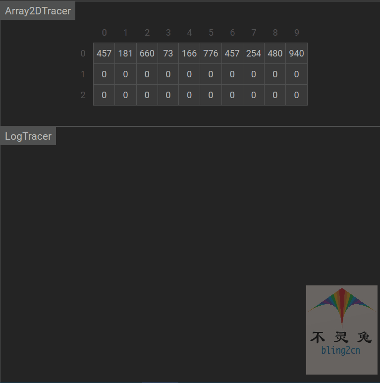

# 基数排序

## 简介

基数排序(Radix Sort)是一种非比较整数排序算法，是桶排序的扩展。基本思想：

1.将所有待比较数值同意为同样的数位长度，数位较短的数前面补0

2.按照低位先排序，然后再收集

3.以此类推，直到最高位，最终得到排号序的数列

4.对于数值偏小的一组序列，其速度是非常快的，时间复杂度达到了线性，而且思想也非常巧妙

## 实现步骤

1.取得数组中的最大数，并取得位数

2.对数位较短的数，前面补零

3.分配，先从各位开始，根据位值0-9分别放到0-9号桶中

4.收集，再将放置0-9号桶中的数据按顺序放到数组中

5.重复3-4过程，直到最高位，即可完成排序

## 代码实现(Python)

```python
from typing import List

def radix_sort(arr: List[int]):
    """基数排序"""
    # 1.记录最大值的位数
    n = len(str(max(arr)))
    
    # 2.n轮排序
    for k in range(n):
        # 2.1每一轮生成10个列表
        # 2.2因为每一位数字都是0-9，因此建立10个桶
        bucket_list = [[] for i in range(10)]
        for i in arr:
            # 2.3按第k位放入到桶中
            bucket_list[i // (10 ** k) % 10].append(i)
        # 3.按当前桶的顺序重排列表
        arr = [j for i in bucket_list for j in i]
    return arr


# 测试数据
if __name__ == '__main__':
    import random
    random.seed(54)
    arr = [random.randint(0,100) for _ in range(10)]
    print("原始数据：", arr)
    arr_new = radix_sort(arr)
    print("计数排序结果为：", arr_new)
    
    
# 输出结果
原始数据： [17, 56, 71, 38, 61, 62, 48, 28, 57, 42]
计数排序结果为： [17, 28, 38, 42, 48, 56, 57, 61, 62, 71]
```

## 动图演示

  

## 算法分析

-   时间复杂度

设待排序的数组$R[1, 2, ... , n]$，数组中最大的数是k位数，基数为r(十进制基数为10，数字0-9，最多需要10个桶来映射数组元素)，处理一位数，需要将数组元素映射到r个桶中，映射完成后还需要收集，相当于遍历整个数组，则遍历一位数的时间复杂度为$O(n + r)$，总的时间复杂度为$O((n + r) × k)$

-   空间复杂度

基数排序过程中，需要开辟r个队列，最坏条件可能用到 $r × n$的二维数组来作为桶，所有时间复杂度为$O(r × n)$

-   稳定性

| 时间复杂度(平均) | 时间复杂度(平均) | 时间复杂度(最坏) | 空间复杂度 | 排序方式  | 稳定性 |
| ---------------- | ---------------- | ---------------- | ---------- | --------- | ------ |
| $O((n + r) × k)$ | $O((n + r) × k)$ | $O((n + r) × k)$ | $O(r × n)$ | out_place | 稳定   |


