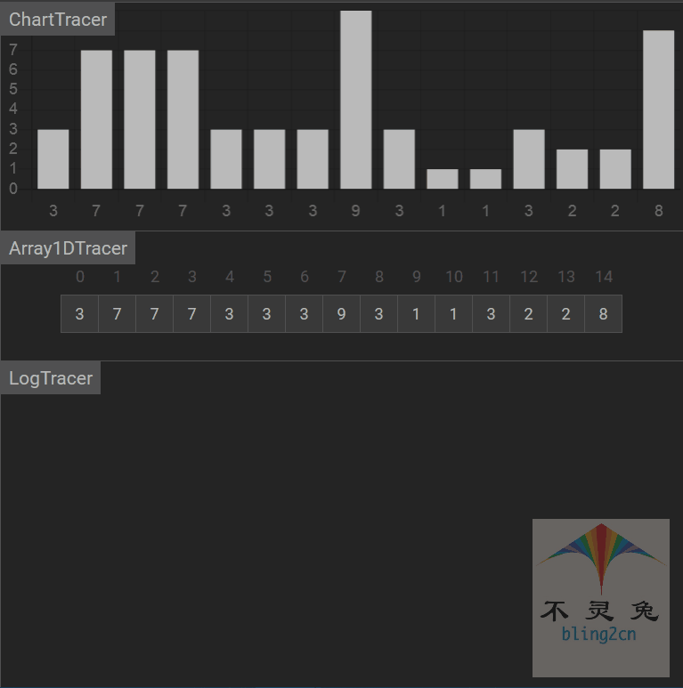

# 冒泡排序

## 简介

冒泡排序(Bubble Sort)是经典算法之一，术语交换排序的一种，其基本的排序思想：

1.从头开始两两元素进行比较，值大的元素就往上冒

2.遍历完成后便直接筛选出元素的最大值

3.重复上述操作，即可获取第二大的元素

4.以此类推，直到所有的元素排序完成

## 实现步骤

1.比较相邻的元素，如果第一个比第二个大，就交换它们(确定排序规则：从小到大或从大到小)

2.对没一对相邻元素做同样的工作，从开始第一对到结尾的最后一对

3.针对所有重复以上的步骤，除了最后一个

4.重复1~3步骤，直到没有任何一对元素需要比较，那么排序则已完成

## 代码实现(Python)

```python
from typing import List

def bubble_sort(arr: List[arr]):
    """
    冒泡排序(bubble_sort)
    :param arr: 待排序的List，此处现在了排序类型为int
    :param: 冒泡排序是就地排序(in-place)
    """
    # 1.获取数组的长度
    arrLen = len(arr)
    
    # 2.如果数组的长度小于或等于1
    if arrLen <= 1: return
    
    # 3.遍历数组
    for i in range(arrLen):
        
        # 3.1 设置标志位。如本身已经有序，则直接break
        is_swap = False
        
        # 3.2 遍历数组
        for j in range(arrLen - i - 1):
            
            # 3.3 如果前面的值大于后面的值，则交换位置
            if arr[j] > arr[j + 1]:
                arr[j], arr[j + 1] = arr[j + 1], arr[j]
                
                # 3.4 判断是否交换过，有序
                is_swap = True
                
            # 3.5 如果没有交换，则直接退出
            if not is_swap: 
                break

# 测试数据
if __name__ == '__main__':
    import random
    random.seed(54)
    arr = [random.randint(0,100) for _ in range(10)]
    print("原始数据：", arr)
    bubble_sort(arr)
    print("冒泡排序结果：", arr)

# 输出结果
原始数据： [17, 56, 71, 38, 61, 62, 48, 28, 57, 42]
冒泡排序结果： [17, 28, 38, 42, 48, 56, 57, 61, 62, 71]
```

## 动图演示

  

## 算法分析

-   时间复杂度

如果数据一开始就是为有序的，那么只需要1趟排序即可完成，所需要的比较次数和记录移动次数M均为最小值：

$$Cmin = n - 1, Mmin = 0$$

所有冒泡排序最好的时间复杂度为$$0(n)$$，如果数据一开始为逆序，则需要 n - 1趟排序，每趟要进行 n - i 次比较，且每次必须移动记录3次来达到交换记录的位置，此时，比较和移动次数均达到最大值：


-   空间复杂度

空间复杂度就是在交换元素时，那个临时遍历所占的内存空间，最有的空间复杂度就是开始元素顺序已经排好了，则空间复杂度为0，最差的空间复杂度就是元素逆序排序，则空间复杂度为$$O(n)$$，平均的空间复杂度为$$O(1)$$.

-   稳定性

由于在比较的过程中，当两个相同大小的元素相邻，值比较大或者小，但不会交换位置，而当两个相等元素距离较远时，也只会把它们交换到相邻的位置，也就是说在排序过程中，相等元素的位置前后关系不会发生任何变化，所有算法时稳定的.

-   总结

| 时间复杂度(平均) | 时间复杂度(平均) | 时间复杂度(最坏) | 空间复杂度 | 排序方式 | 稳定性 |
| ---------------- | ---------------- | ---------------- | ---------- | -------- | ------ |
| $$O(n^2)$$       | $$O(n)$$         | $$O(n^2)$$       | $$O(1)$$   | in_place | 稳定   |


