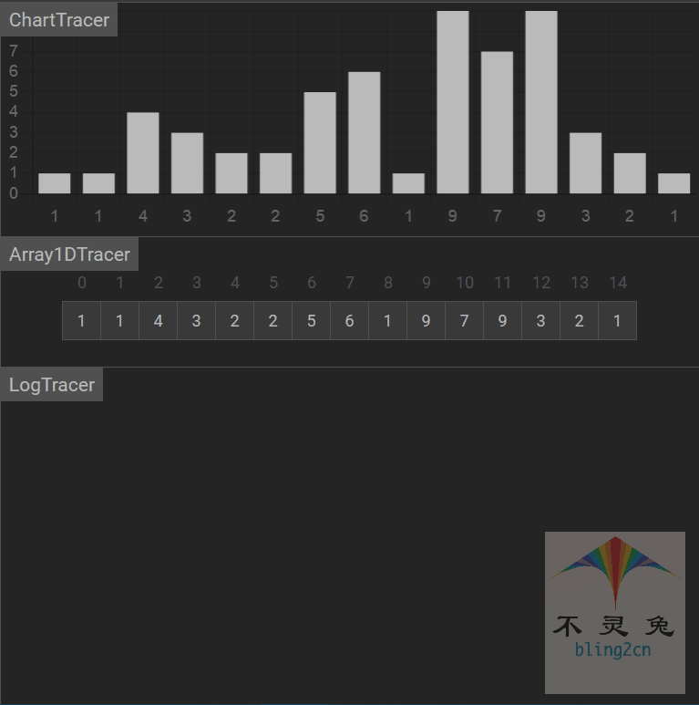

# 选择排序

## 简介

选择排序(select sort)是一种简单直观的排序算法，它的工作原理是：

1.首先在未排序序列中，找到最小(大)元素，存放到排序序列的其实位置

2.然后，再从剩余未排序元素中继续寻找最小(大)元素，然后放到已排序序列的末尾

3.以此类推，直到所有元素均排序完成

## 实现步骤

1.初始状态：无序区间为$$R[1, ....n]$$，有序区间为空

2.第$$i$$趟排序($$i = 1, 2, 3, ....n - 1$$)开始时，当有序区间和无序区间分别为$$R[1,..., i - 1]$$和$$R[i, ....n]$$.该趟排序从无序区间中，选出关键值最小的记录$$R[k]$$将它与无需区间的第1个记录$$R$$交换，使$$R[1,...i]$$和$$[i + 1, ... ,n]$$，分别变为记录个数增加1个的新有序区间和记录个数减少1个的新无序区间.

3.$$n - 1$$趟结束，所有元素完成排序.

## 代码实现(Python)

```python
from typing import List

def select_sort(arr: List[int]):
    """
    选择排序(select_sort)
    :param arr: 待排序数组List
    :return: 选择排序是就地排序(in_place)
    """
    # 1.获取数组长度
    arrLen = len(arr)
    
    # 2.判断数组长度是否小于等于1，如果小于，则没有排序的必要
    if arrLen <= 1:
        return
    
    # 3.遍历数组
    for i in range(arrLen):
        # 3.1设置最小索引为i
        min_idx = i
        # 3.2设置最小索引对应的值为arr[i]
        min_val = arr[i]
        # 3.3在i范围内，完成所有遍历
        for j in range(i, arrLen):
            # 3.4如果从j中取到的值，小于i最小索引值，则将i最小索引值，赋给j
            if arr[j] < min_val:
                min_val = arr[j] # 3.4.1 min_val = arr[i] ----> arr[i] = arr[j]
                min_idx = j # 3.4.2 min_idx = i -----> i = j
        # 交换值
        arr[i], arr[min_idx] = arr[min_idx], arr[i]

        
# 测试数据

if __name__ == '__main__':
    import random
    random.seed(54)
    arr = [random.randint(0,100) for _ in range(10)]
    print("原始数据：", arr)
    selection_sort(arr)
    print("选择排序结果：", arr)
    
    
# 输出结果

原始数据： [17, 56, 71, 38, 61, 62, 48, 28, 57, 42]
选择排序结果： [17, 28, 38, 42, 48, 56, 57, 61, 62, 71]
```

## 动图演示

  

## 算法分析

-   时间复杂度

选择排序的比较次数与序列的初始排序无关，假设待排序的系列有n个元素，那么比较的次数总是$\frac{n(n-1)}{2}$.

而移动次数与初始排序状态有关，当初始为顺序时，移动次数最少为0，当初始为逆序时，移动次数最多：

$\frac{3n(n - 1)}{2}$，所以选择排序的时间复杂度为$O(n^2)$.

-   空间复杂度

空间复杂度就是在交换元素时那个临时遍历所占的内存空间，平均的空间复杂度为：$0(1)$

-   稳定性

在排序过程中，相等元素的位置关系会发生任何变化，所以算法不是和稳定

-   总结

| 时间复杂度(平均) | 时间复杂度(平均) | 时间复杂度(最坏) | 空间复杂度 | 排序方式 | 稳定性 |
| ---------------- | ---------------- | ---------------- | ---------- | -------- | ------ |
| $O(n^2)$         | $O(n^2)$         | $O(n^2)$         | $O(1)$     | in_place | 不稳定 |


