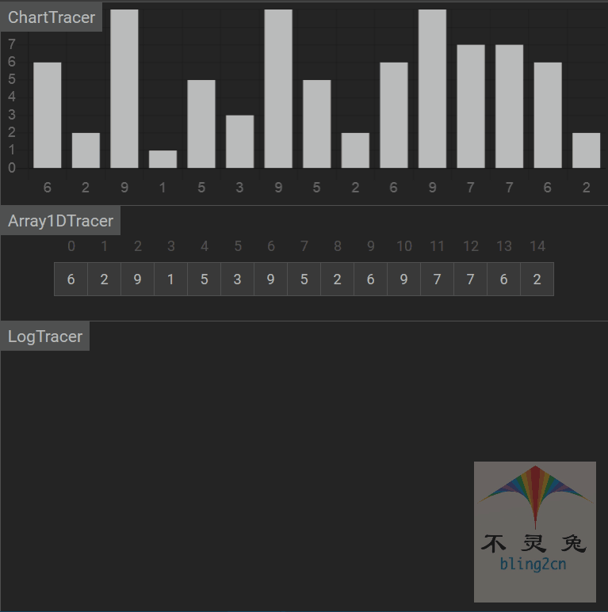
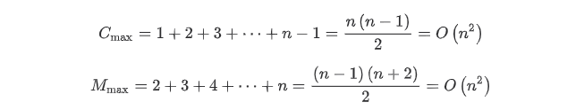

# 插入排序

## 简介

插入排序(insert_sort)是一种简单直观的排序算法，它的工作原理是：

1.通过构建有序序列

2.对于未排序的数据，在已排序序列中从后向前扫描，找到相对应位置并插入

## 实现步骤

1.从第一个元素开始，该元素可以认为已经被排序

2.取出下一个元素，在已经排序的元素序列从后向前扫描

3.如果该元素(已经排序)大于新元素，则将该元素移动到下一个位置

4.重复步骤3，直到找到已排序的元素小于或者等于新元素的位置

5.将新元素插入到该位置后

6.重复步骤2~5

## 代码实现(Python)

```python
from typing import List

def insert_sort(arr: List(int)):
    """
    插入排序
    :param arr:待排序List
    :return: 插入排序是就地排序(in-place)
    """
    # 1.获取数组长度
    arrLen = len(arr)
    
    # 2.判断数组长度是否小于(等于)1，如果小于或(等于)1则没有排序的必要
    if arrLen <= 1:
        return
    
    # 3.遍历数组
    for i in range(1, arrLen):
        
        # 3.1 将每次索引遍历获取的值，赋给value
        value = arr[i]
        
        # 3.2 每遍历一次减去1
        j = i - 1
        
        # 3.3 判断arr[j] 是否大于value(arr[i])
        hwile j >= 0 and arr[j] > value:
            
            # 3.4 赋值
            arr[j + 1] = arr[j]
            j -= 1
            
        # 3.5 交换值
        arr[j + 1] = value
        

# 测试数据
if __name__ == '__main__':
    import random
    random.seed(54)
    arr = [random.randint(0,100) for _ in range(10)]
    print("原始数据：", arr)
    insertion_sort(arr)
    print("插入排序结果：", arr)
    
    
# 输出结果
原始数据： [17, 56, 71, 38, 61, 62, 48, 28, 57, 42]
插入排序结果： [17, 28, 38, 42, 48, 56, 57, 61, 62, 71]
```

## 动图演示

  

## 算法分析

-   时间复杂度

如果数据初始是顺序的，只需要外循环 n - 1 次，每次进行一次比较，无限移动元素，即可完成，所需的比较次数$C$和记录次数$M$均达到最小值为：$Cmin = n - 1, Mmin = 0$.

所以，插入排序最好的时间复杂度为$O(n)$，如果数据初始是逆序的 ，则需要进行$n - 1$趟排序，每次排序中待插入的元素都要和$[0, i - 1]$中的$i$个元素进行比较，并将这$i$个元素后移$i$次，每趟移动的次数为$i + 2$，此时比较和移动次数均达到最大值为：



所以，平均时间复杂度为$O(n^2)$

-   空间复杂度

空间复杂度就是在交换元素时，那个临时遍历所占的内存空间，与数据规模无关，空间复杂度为$O(1)$

-   稳定性

排序过程中，相同元素的相对位置保持不变，所以插入排序属于稳定排序

-   总结

| 时间复杂度(平均) | 时间复杂度(平均) | 时间复杂度(最坏) | 空间复杂度 | 排序方式 | 稳定性 |
| ---------------- | ---------------- | ---------------- | ---------- | -------- | ------ |
| $O(n^2)$         | $O(n)$           | $O(n^2)$         | $O(1)$     | in_place | 稳定   |


