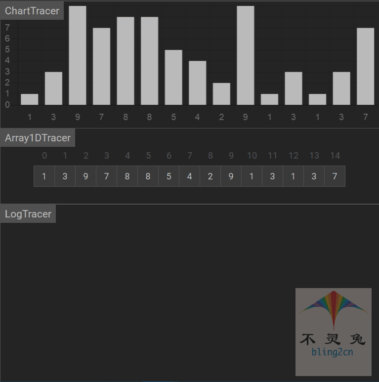
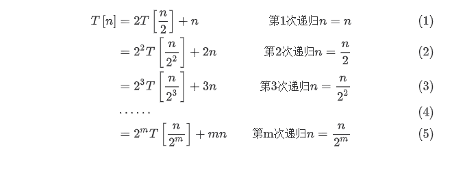
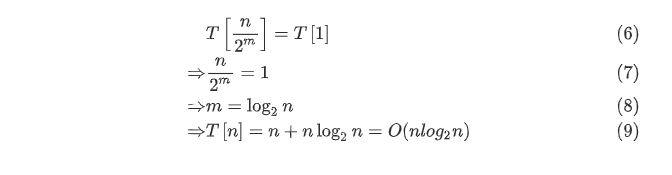

# 快速排序

## 简介

快速排序(quick sort)是对冒泡排序的一种改进，其基本思想是：

1.选取一个基准元素

2.依次将剩余元素中小于该基准的值放置其左侧，大于等于该基准元素的值放置右侧

3.然后，取出基准元素的前半部分和后半部分分别进行同样的处理，以此类推

4.直到各个子序列剩余一个元素时，即排序完成(类比二叉树思想)

## 实现步骤

1.首先设定一个分界值(pivot)，通过该分界值将数组分成左右两部分

2.将大于或等于分界值的数据集中到数组右边，小于分解值的数据集中的数组的左边，因此，左边部分中各个元素都小于或等于分界值，而右边部分中各个元素都大于或等于分界值，这个称为分区(partition)操作.

3.然后，左边和右边的数据可以独立排序，对于左侧的数组数据，又可以取一个分界值，将该部分数据分成左右两部分，同样在左边放置较小值，右边放置较大值，右侧的数组数据也可以做类似处理.

4.重复上述过程，通过递归(recursive)将左侧部分排序好，再递归排好右侧部分的顺序，当左、右两个部分各个数据排序完成后，整个数组的排序也就完成了.

## 代码实现(Python)

```python
from typing import List

def partition(arr: List[int], low: int, heigh: int):
    """数据分区"""
    
    # 1.设置分界值，并获取数组中分界值对应的值(pivot = arr[low], j = low)
    pivot, j = arr[low], low
    
    # 2.遍历数组
    for i in range(low+1, heigh + 1):
        
        # 3.判断条件是否符合
        if arr[i] <= pivot: # arr[low]
            j += 1
            
            # 4.交换元素
            arr[j], arr[i] = arr[i], arr[j]
            
    # 5.交换值
    arr[low], arr[j] = arr[j], arr[low]
    
    return j


def quick_sort_between(arr: List[int], low: int, heigh: int):
    """进行快速排序"""
    
    # 1.递归结束条件
    if heigh - low <= 1:
        return
    
    # 2.arr[m]作为划分标准
    m = partition(arr, low, heigh)
    quick_sort_between(arr, low, m - 1)
    quick_sort_between(arr, m + 1, heigh)
    
def quick_sort(arr: List[int]):
    """
    快速排序(in-place)
    :param arr:待排序的List
    :return: 快速排序是就地排序(in-place)
    """
    
    # 1.进行快速排序
    quick_sort_between(arr, 0, len(arr) - 1)
    
    
# 测试数据
if __name__ == '__main__':
    import random
    random.seed(54)
    arr = [random.randint(0,100) for _ in range(10)]
    print("原始数据：", arr)
    quick_sort(arr)
    print("快速排序结果：", arr)
    
    
    
# 输出结果
原始数据： [17, 56, 71, 38, 61, 62, 48, 28, 57, 42]
快速排序结果： [17, 28, 38, 42, 48, 56, 57, 61, 62, 71]
```

## 动图演示

  

## 算法分析

-   时间复杂度

快速排序最优的清空就是每一次取到的元素，刚刚好评分整个数组，此时的时间复杂度公式为：

$$T[n] = 2T[\frac{n}{2}] + f(n)$$

则$T[n]$为平分后的子数组的时间复杂度，$f(n)$为平分这个数组时所花的时间：



当最后平分的不能再平分时：




快速排序最优的情况下，时间复杂度为： $(n{log_2{n}})$最差的情况就是每一次取到元素就时数组中最小值/最大值，这种情况其实就是冒泡排序(每一次都排好一个元素的顺序)，这中情况时间复杂度就是冒泡排序的时间复杂度：

$T[n] = n[n - 1] = n ^ 2 + n = O(n ^ 2)$ 

快速排序最差的情况下，时间复杂度为：$O(n ^ 2)$

快速排序的平均时间复杂度为：$O(nlog_2n)$

-   空间复杂度

首先就地快速排序使用的空间为$O(1)$，也就是个常数级，真正消耗空间的就是递归调用，因为每次递归就要保持一些数据.

最优的情况就是每一次都平分数组，空间复杂度为：$O(log_2n)$

最差的情况就是退化为冒泡排序，空间复杂度为：$0(n)$

-   稳定性

排序过程中，相同的元素无法保证相对应位置不变，因此，快速排序属于不稳定排序

-   总结

| 时间复杂度(平均) | 时间复杂度(平均) | 时间复杂度(最坏) | 空间复杂度  | 排序方式 | 稳定性 |
| ---------------- | ---------------- | ---------------- | ----------- | -------- | ------ |
| $O(nlog_2n)$     | $O(nlog_2n)$     | $O(n^2)$         | $O(log_2n)$ | in_place | 不稳定 |


