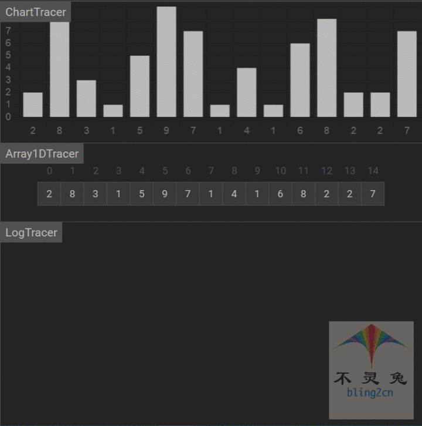

# 希尔排序

## 简介

希尔排序(shell sort)属于插入排序的一种，也称为缩小增量的排序，是直接插入排序的一种更搞笑的改进版本，其基本思想：

1.先将整个待排序元素序列分割成若干个子序列(由相隔某个"增量"的元素组成的)，分别进行插入排序

2.然后依次缩减增量再进行排序，待整个序列种的元素基本有序(增量足够小)时

3.再对全体元素进行一次直接插入排序

因为直接插入排序再元素基本有序的清空下，效率是很高的，因此希尔排序在时间效率比直接插入排序由较大提高

## 实现步骤

1.选择一个增量序列$t1$，$t2$，......，$tk$，其中$tk = 1(增量的取法：ti = \frac{n}{2^i})$

2.按增量序列个数k，对序列进行k趟排序

3.每趟排序根据对应的增量$ti$，将待排序分割成若干个为$m$的子序列，分别对各个序列进行直接插入排序，当增量因子为1时，整个序列作为一个序列来处理，排序完成

## 代码实现(Python)

```python
from typing import List

def shell_sort(arr: List(int)):
    """
    希尔排序
    :param arr:待排序的List
    :return 希尔排序时就地排序(in-place)
    """
    # 1.获取数组的长度
    arrLen = len(arr)
    
    # 2.分成若干个子序列
    dist = arrLen // 2
    
    # 3.遍历子序列
    while dist > 0:
        for i in range(dist, arrLen):
            
            # 3.1 定义临时存储变量
            temp = arr[i]
            j = i
            
            # 3.2 判断长度与值的大小
            while j >= dist and temp < arr[j - dist]:
                arr[j] = arr[j - dist]
            	j -= dist
                
            # 3.3 交换变量
            arr[j] = temp
            
        dist //= 2

# 测试数据
if __name__ == '__main__':
    import random
    random.seed(54)
    arr = [random.randint(0,100) for _ in range(10)]
    print("原始数据：", arr)
    shell_sort(arr)
    print("希尔排序结果：", arr)
    
    
# 输出结果
原始数据： [17, 56, 71, 38, 61, 62, 48, 28, 57, 42]
希尔排序结果： [17, 28, 38, 42, 48, 56, 57, 61, 62, 71]
```

## 动图演示

  

## 算法分析

-   时间复杂度

当一开始为顺序时，效率u自高，时间复杂度最好($O(nlog_2n)$)，当一开始为逆序时，效率最低，时间复杂度为($O(n^2)$)，希尔排序的时间复杂度取决于增量的选取，用于不同的序列，时间复杂度可能不同，较快完成排序的平均时间复杂度为($O(n^1.3)$)

-   空间复杂度

空间复杂度就是在交换元素时，那个临时变量所占的内存空间，所以时间复杂度为($O(1)$)

-   稳定性

希尔排序需要多次插入排序，在不同的插入排序过程中，相同的元素可能在各自的插入排序中进行移动，最后其稳定性就会被打乱，所以希尔排序是不稳定的

-   总结

| 时间复杂度(平均) | 时间复杂度(平均) | 时间复杂度(最坏) | 空间复杂度 | 排序方式 | 稳定性 |
| ---------------- | ---------------- | ---------------- | ---------- | -------- | ------ |
| $O(n^{1.3})$     | $O(nlog_2n)$     | $O(n^2)$         | $O(1)$     | in_place | 不稳定 |


