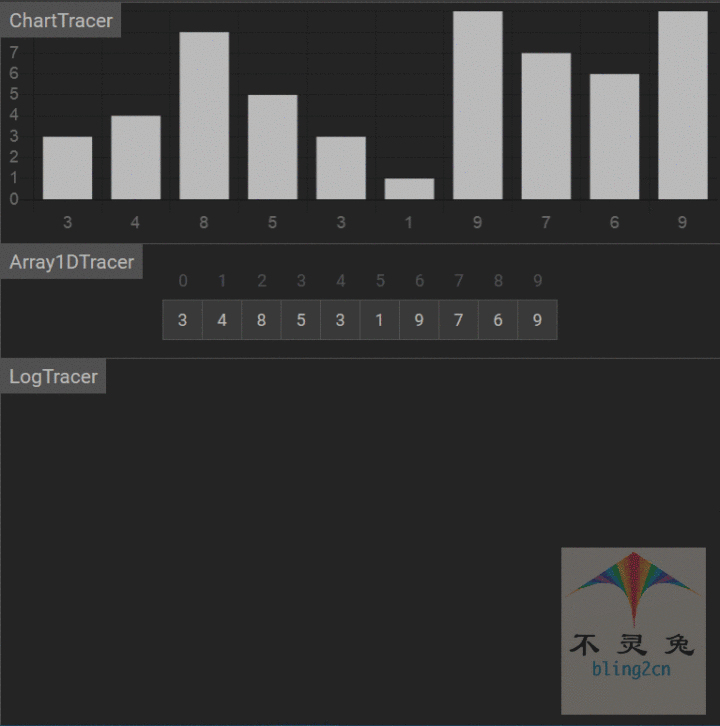

# 堆排序

## 简介

堆排序(heap sort)是利用堆这种数据结构而设计的一种排序算法，是一种选择排序。

堆具有以下性质的完全二叉树：

1.每个节点的值都大于或等于左右孩子节点的值，称为 **大顶堆**

2.每个节点的值都小于或等于其左右孩子节点的值，称为 **小顶堆**


堆排序的思路：

1.将无序序列调整为一个堆，就能找出序列中的最大值(或最小值)

2.然后将找出的这个元素与末尾元素进行交换，这样有序序列元素就增加一个，无序序列元素就减少一个

3.对新的无序序列重复操作，从而实现排序


## 实现步骤

1.构造初始堆，将给定的无序序列构成一个大顶堆(一般采用大顶堆，降序采用小顶堆)

2.将堆顶元素与末尾元素进行交换，是末尾元素最大，然后继续调整堆，再将堆顶元素末尾元素进行交换，得到第二大元素

3.重新调整结构，使其满足堆定义，然后继续交换堆顶元素与当前末尾元素

4.如此反复进行交换，重建、交换，直到整个序列有序

## 代码实现(Python)

```python
def build(arr: List[int], root, end):
    """构建堆"""
    while True:
        # 1.左节点的位置
        child = 2 * root + 1
        
        # 2.若左节点超过了最后一个节点，则终止循环
        if child > end:
            break
            
        # 3.若右节点在最后一个节点之前，并且右节点比左节点大，则将孩子指针移动到右子节点上
        if (child + 1 <= end) and (arr[child + 1] > arr[child]):
            child += 1
        # 4.若最大的孩子节点大于根节点，则交换两者顺序并且将根节点指针移动到这个孩子节点上
        if arr[child] > arr[root]:
            arr[child], arr[root] = arr[root], arr[child]
            root = child
        else:
            break
            
def heap_sort(arr: List[int]):
    """
    堆排序
    :param arr: 待排序数组
    :return 返回排序结果
    """
    # 1.获取数组长度
    arrLen = len(arr)
    
    # 2.确认最深最后的那个根节点的位置
    first_root = n // 2 - 1
    
    # 3.由后向前遍历所有的根节点，建堆并进行调整
    for root in range(first_root, -1, -1):
        build(arr, root, n - 1)
    # 4.调整完成后，将堆顶的根节点与堆内最后一个元素调换位置，此时为数组中最大的元素，
    #   然后重新调整堆，将最大的元素冒到堆顶。依次重复上述操作
    for end in range(n - 1, 0, -1):
        arr[0], arr[end] = arr[end], arr[0]
        build(arr, 0, end - 1)
        
        
# 测试数据
if __name__ == '__main__':
    import random
    random.seed(54)
    arr = [random.randint(0,100) for _ in range(10)]
    print("原始数据：", arr)
    heap_sort(arr)
    print("堆排序结果：", arr)
    
    
# 输出结果
原始数据： [17, 56, 71, 38, 61, 62, 48, 28, 57, 42]
堆排序结果： [17, 28, 38, 42, 48, 56, 57, 61, 62, 71]
```

## 动图演示

  

## 算法分析

-   时间复杂度

在每次重建时，随着堆的溶剂的减小，层数也会下降，函数时间复杂度的会变化，重建堆一共需要n - 1次循环，每次循环比较的次数为$log_2i$，则相加为：


所以，堆排序的时间复杂度为$(O(nlog_2n))$

-   空间复杂度

空间复杂度就是在交换元素时那个临时遍历所占用的内存空间，所有堆排序空间复杂度为$(O(1))$

-   稳定性

堆排序在交换数据的时候，是比较父节点和子节点之间的数据，所有，即使在存在两个值相等的兄弟节点，它们的相对顺序在排序也可能发生变换。因此堆排序是不稳定的

-   总结

| 时间复杂度(平均) | 时间复杂度(平均) | 时间复杂度(最坏) | 空间复杂度 | 排序方式 | 稳定性 |
| ---------------- | ---------------- | ---------------- | ---------- | -------- | ------ |
| $O(nlpg_2n)$     | $O(nlog_2n)$     | $O(nlog_2n)$     | $O(1)$     | in_place | 不稳定 |