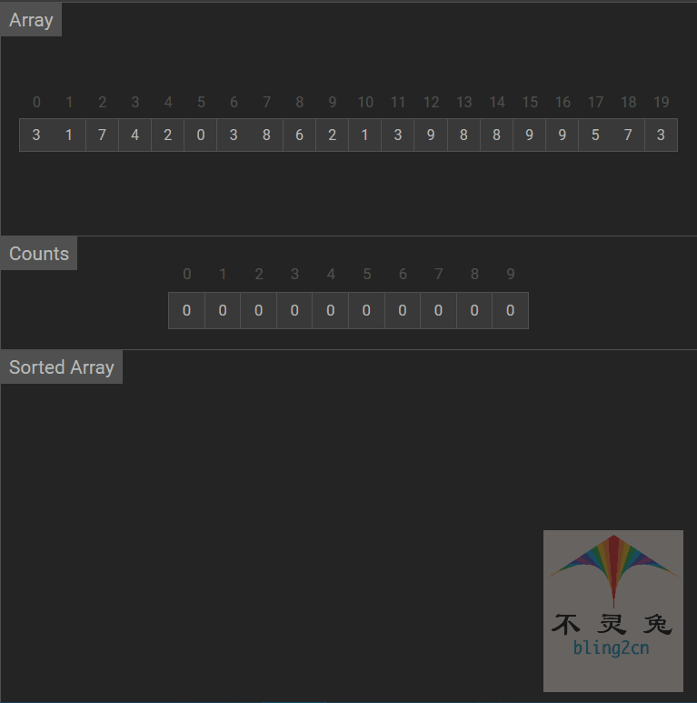

# 计数排序

## 简介

计数排序(Count Sort)不是基于比较的排序算法，其核心在于输入的数据值转化为键存储在额外开辟的数组空间中。作为一种线性时间复杂度的排序，计数排序要求输入的数据必须是确定范围的整数，它的基本思想：

1.给定的输入序列中的每一个元素x

2.确定该序列中值小于等于x元素的个数

3.然后将x直接存放到最终的排序序列的正确位置

## 实现步骤

1.根据待排序集合中最大元素和最小元素的差值范围，申请额外空间

2.遍历待排序集合，将每一个元素出现的次数记录到元素值对应的额外空间内

3.对额外空间内数据进行计算，得出每一个元素的正确位置

4.将待排序集合每一个元素移动到计算得出的正确位置上

## 代码实现(Python)

```python
from typing import List

def counting_sort(arr: List[int]):
    """
    计数排序
    :param arr: 待排序数组
    :return 
    """
    # 1.定义默认最小值和最大值
    max = min = 0
    
    # 2.遍历数组
    for i in arr:
        # 2.1如果i小于min
        if i < min:
            min = i
        # 2.2如果i大于max
        if i > max:
            max = i
    
    # 3.定义计算长度
    count = [0] * (max - min + 1)
    
    # 4.遍历数组长度
    for j in range(max - min + 1):
        count[j] = 0
        
    for index in arr:
        count[index - min] += 1
    
    index = 0
    
    for a in range(max - min + 1):
        for c in range(count(a)):
            arr[index] = a + min
            index += 1
            
# 测试数据
if __name__ == '__main__':
    import random
    random.seed(54)
    arr = [random.randint(0,100) for _ in range(10)]
    print("原始数据：", arr)
    counting_sort(arr)
    print("计数排序结果", arr)
    
# 输出结果
原始数据： [17, 56, 71, 38, 61, 62, 48, 28, 57, 42]
计数排序结果 [17, 28, 38, 42, 48, 56, 57, 61, 62, 71]
```

## 动画演示

  

## 算法分析

-   时间复杂度

数据取值范围是常数k，待排序元素个数是n，总时间复杂度是$$O(n + k)$$

-   空间复杂度

计数排序只需要额外的空间复杂度为$O(k)$，所以计数排序的空间复杂度为$O(k)$

-   稳定性

计数排序不会改变相等元素的相对位置，所以计数排序是稳定的

-   总结

| 时间复杂度(平均) | 时间复杂度(平均) | 时间复杂度(最坏) | 空间复杂度 | 排序方式  | 稳定性 |
| ---------------- | ---------------- | ---------------- | ---------- | --------- | ------ |
| $O(n + k)$       | $O(n + k)$       | $O(n + k)$       | $O(k)$     | out_place | 稳定   |

  