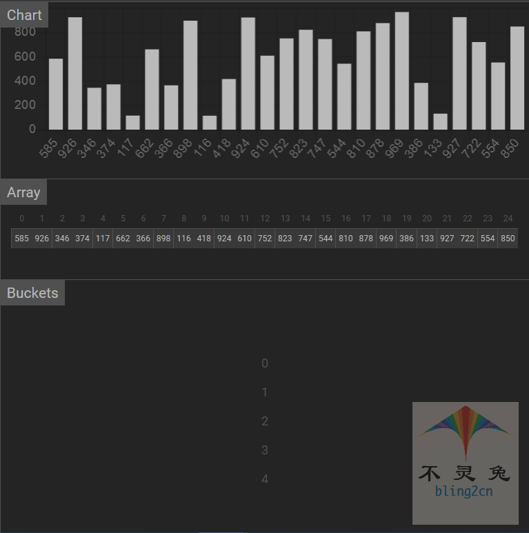
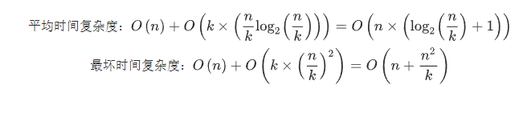

# 桶排序

## 简介

桶排序(Bucket Sort)，也叫箱排序，其主要思想：

1.待排序集合中处于同一个值域的元素存入同一个桶中

2.也就是根据元素值特性将集合拆分为多个区域，则拆分后形成的多个桶

3.从值域上看是处于有序的

4.对每个桶中元素进行排序，则所有桶中元素构成的集合是已排序的

桶排序是计数排序的扩展版本，计数排序可以看成每个桶只存储相同元素，而桶排序每个桶存储一定范围的元素，桶排序需要尽量包装元素分散均匀，否则当所有数据集在同一个桶中时，桶排序失效。

## 实现步骤

1.根据待排序集合中最大元素和最小元素的差值范围和映射规则，确定申请的桶个数

2.遍历排序序列，将每个元素放到对应的桶里面去

3.对不是空的桶进行排序

4.按顺序访问桶，将桶中的元素一次放回到原序列中对应的位置，完成排序

## 代码实现(Python)

```python
from typing import List

def bucket_sort(arr: List[int]):
    """桶排序"""
    # 1.定义最大和最小数量
    min_num = min(arr)
    max_num = max(arr)
    
    # 2.桶的大小
    bucket_range = (max_num - min_num) / len(arr)
    
    # 3.桶组数
    count_list = [[] for i in range(len(arr) + 1)]
    
    # 4.向桶中填数
    for i in arr:
        count_list[int((i - min_num) // bucket_range)].append(i)
    arr.clear()
    
    # 5.回填，这里桶内部排序调用了sorted
    for i in count_list:
        for j in sorted(i):
            arr.append(j)

# 测试数据
if __name__ == '__main__':
    import random
    random.seed(54)
    arr = [random.randint(0,100) for _ in range(10)]
    print("原始数据：", arr)
    bucket_sort(arr)
    print("桶排序结果：", arr)
    
# 输出结果
原始数据： [17, 56, 71, 38, 61, 62, 48, 28, 57, 42]
桶排序结果： [17, 28, 38, 42, 48, 56, 57, 61, 62, 71]
```

## 动图演示



## 算法分析

-   时间复杂度

最好情况：输入序列是拍好序的，插入排序的时间复杂度在$O(n)$，即最好情况下时间复杂度为$O(n)$

最坏情况：对于待排序序列序列大小为n，共分为k个桶，需要进行n次循环。将每个元素装入对应的桶中，k次循环，对每个桶的数据进行排序(平均每个桶有n/k个元素)，若采用快速排序算法进行排序，单词排序的平均时间复杂度为$O(nlog_2n)$，最坏时间复杂度为$O(n^2)$，而桶排序的过程是以链表形式插入的，所有整个桶排序的时间复杂度为：



当n = k时，时间复杂度最低为$O(n)$，当 k = 1时，时间复杂度最高为$O(n + n^2)$，所以最坏时间复杂度为$O(n^2)$。

平均情况：平均时间复杂度为$O(n)$

-   空间复杂度

桶排序过程中需要创建k个桶的额外空间，以及n个元素的额外空间，所以桶排序的空间复杂度为$O(n + k)$

-   稳定性

桶排序的稳定性去取决于桶内排序使用的算法，如果是队列，可以包装相同的元素取出和放回的相对位置不变，即排序是稳定的，而如果用栈来实现，则排序一定是最不稳定的，由于桶排序可以做到稳定，所以桶排序是稳定的排序算法

-   总结

| 时间复杂度(平均) | 时间复杂度(平均) | 时间复杂度(最坏) | 空间复杂度 | 排序方式  | 稳定性 |
| ---------------- | ---------------- | ---------------- | ---------- | --------- | ------ |
| $O(n)$           | $O(n)$           | $O(n^2)$         | $O(n + k)$ | out_place | 稳定   |

