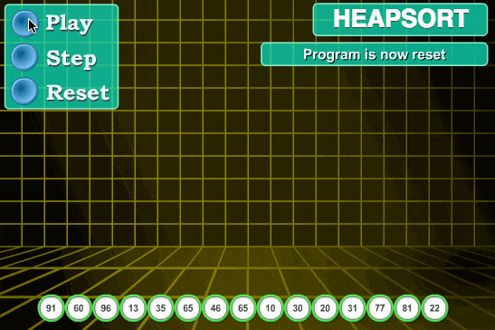

# Top Ten Sequences

## 排序算法

排序算法是《数据结构与算法》中最基本的算法之一，排序算法可以分为内部排序和外部排序。

1、内部排序

-   内存排序是数据记录再内存中进行排序

2、外部排序

-   外部排序是因排序的数据很大，一次不能容纳全部的排序记录，在排序过程中需要访问外存

常见的内存排序算法：

-   插入排序
-   希尔排序
-   选择排序
-   冒牌排序
-   归并排序
-   快速排序
-   堆排序
-   基数排序...

  

排序算法之间的比较：

  

时间复杂度：

1、平方阶$$(O(n ^ 2))$$ 排序：直接插入、直接选择和冒泡排序

2、线性阶$$(O(nlog2n))$$ 排序：快速排序、堆排序和归并排序

3、$$(O(n1+§))$$ 排序：§ 是介于 0 和 1 之间的常数：希尔排序

4、线性阶 $$(O(n))$$ 排序：基数排序，此外还有桶、箱排序

稳定性：

1、稳定排序算法：冒泡排序、插入排序、归并排序和基数排序

2、不稳定排序算法：选择排序、快速排序、希尔排序、堆排序

举例：名词解释

n：数据规模大小

k：“桶”的个数

in_place：占用常数内存，不占用额外内存

out_place：占用额外内存

稳定性：排序后2个相等键值的顺序和排序之前的顺序相同

## ①冒泡排序

冒泡排序(Bubble Sort)是一种简单直观的排序算法，它需要重复地走访过排序的数列，一次比较两个元素，如果它们的顺序错误的(顺序大小不一致)，则将它们交换过来。走访数列的工作是重读地进行，直到没有再需要交换的元素，也就是说该数列已经全部排序完成。这个算法的名字由来是因为：越小的元素会经由交换，慢慢的 “浮”到数列的顶端，也就是数组的第一位为最小值。

冒泡排序还有一种优化算法，就是设置一个角标(或flag)，当再一趟序列变量中元素没有发生交换，则证明该序列已经有些，但这种改进对于效率有一定的提升。

**算法步骤**

1.比较相邻的元素，如果第一个比第二个大，则交换它们

2.对每一对相邻的元素做同样的工作，从开始第一到结尾的最后一对。这步做完后，最后的元素则为最大值

3.针对所有的元素重复以上的步骤，除了最后一个

4.持续每次对越来越少的元素重复上面的步骤，直到没有任何一对数字需要比较

**动态演示：**

  

**什么时候最快？**

当输入数据已经是正序是(都已经为整型了，则不需要冒泡排序，因为不起任何作用)

**什么时候最慢？**

当输入的数据是反序时(写一个for循环反序输出，不需要冒泡排序)

**Python代码实现**

第一种：

```python
from typing import List

def bubble_sort(arr: List[int], n: int):
    """冒泡排序, arr表示数组， n表示数组的长度"""
    if n <= 1: return
    for i in range(n):
        for j in range(n - i - 1):
            if (arr[j] > arr[j + 1]):
                arr[j], arr[j + 1] = arr[j + 1], arr[j] # 交换元素
                
if __name__ == '__main__':
    a = [-1, -2, 2, -3, 4, 5, -5, 7]
    sort_a = bubble_sort(a, len(a))
    print(a)
```

第二种：

```python
from typing import List

def bubble_sort(arr: List[int], n: int):
    """冒泡排序, arr表示数组， n表示数组的长度"""
    if n <= 1: return
    for i in range(n):
    	# 创建flag，用于表示记录已比较过的元素，也称提前退出标志
    	flag = False
    	for j in range(n - i - 1):
            if (arr[j] > arr[j + 1]):
                arr[j], arr[j + 1] = arr[j + 1], arr[j] # 交换元素
                flag = True
                
        if not flag: break # 提前退出
            
if __name__ == '__main__':
    a = [-1, -2, 2, -3, 4, 5, -5, 7]
    sort_a = bubble_sort(a, len(a))
    print(a)
```

## ②选择排序

选择排序时一种简单直观的排序算法，无论什么数据进行都是$$O(n^2)$$的时间复杂度，所有用到它的时候，数据规模越小越好，唯一的好处，可能就是不占用额外的内存空间。

**算法步骤**

1.首先在末排序列中找到最小(大)元素，存放到排序序列的起始位置

2.再从剩余末排序元素中继续寻找最小(大)元素，然后放到已排序序列的末尾

3.重复第二步，直到所有元素均排序完毕

**动态演示**

  

**Python代码实现**

```python
def selection_sort(arr):
    """选择排序"""
    for i in range(len(arr) - 1):
        # 记录最小数的索引
        minIndex  = i
        for j in range(i + 1, len(arr)):
            if arr[j] < arr[minIndex]:
                minIndex = j
        # i 不是最小数时，将i和最小数进行交换
       	if i != minIndex:
            arr[i], arr[minIndex] = arr[minIndex], arr[i]
  	return arr

if __name__ == '__main__':
    arr = [3, 4, 2, 1, 5, 6, 7, 8]
    selection_sort(arr)
    print(arr)
```

## ③插入排序

插入排序的代码实现虽然没有冒牌排序和选择排序那么简单粗暴，但它的原理应该时最容易理解的，因为只要打过扑克牌的人都应该能够秒懂。插入排序时一种简单直观的排序算法，它的工作元素时通过构建有序序列，对未排序的数据，在已排序序列中从后向前烧苗，找到相应位置并插入。插入排序和冒泡排序一样，也有相关的优化，叫做“折半插入”。

**算法步骤**

1.将第一待排序序列第一个元素看作一个有序序列，吧第二个元素到最后一个元素当成时未排序序列

2.从右到尾一次少买哦未排序序列，将烧苗到的每个元素插入有序序列的适当位置

3.如果待插入的元素与有序序列中的某个元素相等，则将带排序插入元素插入到相等元素的后面

**动图演示**

  

**Python代码实现**

```python
def insert_sort(arr):
    # 待插入元素，arr[0: i - 1]作为有序序列
	value = arr[i]
    j = i - 1
    while j >= 0 and arr[j] > value:
        arr[j + 1] = arr[j]
        j -= 1
    # 插入数据
    arr[j + 1] = value
    
if __name__ == '__main__':
    arr = [12, 11, 13, 5, 6]
    insert_sort(arr)
    print ("排序后的数组:")
    for i in range(len(arr)):
        print ("%d" %arr[i])
```

## ④希尔排序

希尔排序，也称为递减增量排序算法，时插入排序的一种更高效的改进版本。但希尔排序是分稳定的算法，希尔排序是基于插入排序的一下两点性质而提出改进方法的：

-   1.插入排序在对几乎已经排好顺序的数据操作时，效率高，即可以达到线性排序的效率
-   2.但插入排序一般来说是低效的，因为插入排序每次只能将数据移动一位

希尔排序的基本思想：

先将整个待排序的记录序列分割成若干个子序列分别进行插入排序，待整个序列中的记录 “基本有序”时，再对全体记录进行依次直接插入排序。

**算法步骤**

1.选择一个增量序列t1, t2, ......, tk，其中ti >tj，tk = 1

2.按增量序列个数k，对序列进行k趟排序

3.每趟排序，根据对于的增量ti，将待排序序列分割成若干长度为m的子序列，分别对各个子表进行直接插入排序。仅增量因子为1时，整个序列作为一个表来进行处理，其表长度即为整个序列的长度。

**动图演示**

  

**Python代码实现**

第一种：

```python
def shell_sort(arr):
    incr = len(arr) // 2
    while incr > 0:
        # i 表示插入元素的角标，arr[0: i: incr]将作为有序序列
        # 例如有序序列角标为{0. ince, 2*incr,......,i - incr}，带插入元素角标为i， {n * incr)}
        for i in range(incr, len(arr), incr):
            # 带插入元素, arr[0: i: incr]作为有序序列
            key = arr[i]
            # j指向有序序列的末端
            j = i - incr
            while j >= 0 and arr[i] > key:
                arr[j + incr] = arr[j]
                j -= incr
            arr[j + incr] = key
        incr //= 2
 	return arr

if __name__ == '__main__':
    a = [1, 2, 4, 6, 7, 5, 9, 8, 10, 11, 16, 12, 14, 18, -1, -3]
    print(shell_sort(a))
```

第二种

```python
def shell_sort(arr):
    import math
    gap = 1 # 设置gap为1
    while (gap < len(arr) / 3):
        gap = gap * 3 + 1
        while gap > 0:
            for i in range(gap, len(arr)):
                tmp = arr[i]
                j = i - gap
                while j >= 0 and  arr[j] > tmp:
                    arr[j + gap] = arr[j]
                    j -= gap
                arr[j + gap] = tmp
            gap = math.floor(gap / 3)
    return arr

if __name__ == '__main__':
    a = [1, 2, 4, 6, 7, 5, 9, 8, 10, 11, 16, 12, 14, 18, -1, -3]
    print(shell_sort(a))
```

第三种：

1.  选择一个增量序列t1,t2,⋯,tk，其中tk=1(增量的取法：$$ti=n / 2^i$$)；
2.  按增量序列个数k，对序列进行k 趟排序；
3.  每趟排序根据对应的增量ti，将待排序列分割成若干长度为m的子序列，分别对各子序列进行直接插入排序。当增量因子为1 时，整个序列作为一个序列来处理，排序完成。

```python
# shell_sort 代码实现

from typing import List

def shell_sort(arr:List[int]):
    """
    希尔排序
    :param arr: 待排序的List
    :return: 希尔排序是就地排序(in-place)
    """
    length = len(arr)
    dist = length // 2
    
    while dist > 0:
        for i in range(dist, length):
            temp = arr[i]
            j = i
            while j >= dist and temp < arr[j-dist]:
                arr[j] = arr[j-dist]
                j -= dist
            arr[j] = temp
        dist //= 2

# 测试数据

if __name__ == '__main__':
    import random
    random.seed(54)
    arr = [random.randint(0,100) for _ in range(10)]
    print("原始数据：", arr)
    shell_sort(arr)
    print("希尔排序结果：", arr)

# 输出结果

原始数据： [17, 56, 71, 38, 61, 62, 48, 28, 57, 42]
希尔排序结果： [17, 28, 38, 42, 48, 56, 57, 61, 62, 71] 
```

**算法分析**

-   时间复杂度
    当一开始为顺序时，效率最高，时间复杂度最好，为O(nlog2n)；当一开始为逆序时，效率最低，时间复杂度最坏，为O(n2)。希尔排序的时间复杂度是取决于增量的选取，用预不同的序列，时间复杂度可能不同，较快完成排序的平均时间复杂度为O(n1.3)。
-   空间复杂度
    空间复杂度就是在交换元素时那个临时变量所占的内存空间，所以空间复杂度为O(1)
-   稳定性
    希尔排序需要进行多次插入排序，在不同的插入排序过程中，相同的元素可能在各自的插入排序中移动，最后其稳定性就会被打乱，所以希尔排序是不稳定的。
-   综合评价

  

## ⑤归并排序

归并排序建立在归并操作上的一种有效排序算法，该算法是采用分治法(divide and conquer)的一个非常典型的应用，作为一种典型的分而治之思想的算法，归并排序的实现由两种方式：

-   自上而下的递归(所有递归的方法都可以迭代重写)
-   自下而上的迭代

**算法步骤**

1.申请空间，使其大小为两个已经排序序列之和，该空间用来存放合并后的序列

2.设置两个指针，最初位置分别为两个已经排序序列的起始位置

3.比较两个指针所指向的元素，选择相对大小的元素放入到合并空间，并移动指针到下一位置

4.重复步骤下，直到某一指针达到序列尾

5.将另一序列剩下的所有元素复制到合并序列尾

**动图演示**

  

**Python代码实现**

第一种：

```python
def merge_sort(arr):
    import math
    if len(arr) < 2:
        return arr
    middle = math.floor(len(arr) / 2)
    left, right = arr[0: middle], arr[middle: ]
    return merge(merge_sort(left), merge_sort(right))

def merge(left, right):
    result = []
    while left and right:
        if left[0] <= right[0]:
        	result.append(left.pop(0))
        else:
            result.append(right.pop(0))
    while left:
        result.append(left.pop(0))
    while right:
        result.append(right.pop(0))
    return result
```

第二种：

```python
import sys

def merge(arr, p, q, r):
    i, j, k = p, q + 1, 0 # 初始化变量i, j, k

    tmp = [0] * (r - p + 1) # 申请一个大小和arr[p: r + 1]一样的临时数组

    while i <= q and j <= r:
        if arr[i] <= arr[j]:
            tmp[k] = arr[i]
            i += 1
        else:
            tmp[k] = arr[j]
            j += 1
        k += 1
    # 判断那个子数组中存在剩余的数据
    start, end = i, q
    if j <= r:
        start, end = j, r
    # 将剩余的数据拷贝到临时数组tmp
    while start <= end:
        tmp[k] = arr[start]
        k += 1
        start += 1
    # 将tmp中的数组拷贝回arr[p:r+1]
    arr[p: r + 1] = tmp

def merge_by_sentry(arr, p, q, r):
    n1, n2 = p - q + 1, r - q # 表示两个子数组的长度
    # 徐存储哨兵，索引需要临时数组长度是子数组长度+1
    L = [0] * (n1 + 1)
    R = [0] * (n2 + 1)

    #拷贝数据到临时数组L[]和R[]
    for i in range(0, n1):
        L[i] = arr[p + i]
    # 第一个数组添加哨兵(最大值)
    L[n1] = sys.maxsize
    for j in range(0, n2):
        R[j] = arr[q + 1 + j]

    # 第二个数组添加哨兵(最大值)
    R[n2] = sys.maxsize

    # 归并临时数组到arr[l.....r]
    i, j, k = 0, 0, p # 初始化变量i, j, k
    while k <= r:
        # 当左边数组到达哨兵值时，i不再增加，直到右边数组读取完剩余值，同理右边数组也一样
        if L[i] <= R[i]:
            i += 2
        else:
            arr[k] = R[j]
            j += 1
        k += 1

def merge_sort(arr, p, r):
    if p >= r:
        return

    q = (p + r) >> 1
    merge_sort(arr, p, q)
    merge_sort(arr, q + 1, r)
    merge(arr, p, q, r)

if __name__ == "__main__":
    # array = [3, 4, 2, 1, 5, 6, 7, 9, 10, 8]
    array = [5, 0, 4, 2, 3, 1, 3, 3, 3, 6, 8, 7]
    merge_sort(array, 0, len(array) - 1)
    print(array)
```

## ⑥快速排序

快速排序是由东尼·霍尔所发展的一种排序算法。在平均状况下，排序N个项目要$$O(nlog^n)$$次比较，在最坏的状况下则需要$$O(n^2)$$次比较，但这种状况并不常见，事实上，快速排序通常明显比其他的$$O(nlog^n)$$算法更快，因为它的内部村换(inner loop)可以在大部分的架构上有效的被实现出来。

快速排序使用分治法(divide and conquer)策略来把一个串行(list)分为两个子串行(sub_lists)，快速排序又是一种分而治之思想在排序算法上的经典应用，本质上来看，快速哦爱心应该算是冒泡排序基础上的递归分治法，快速排序的名字也起得很是简单粗暴，因为一听名字就知道它的意义，就是快，而且效率高，它是出来大数据最大的排序算法之一，虽然worst case的时间复杂度到了$$O(n^2)$$，但是它就是优秀，在大多数情况下，都比平均时间复杂度为$$O(nlog^n)$$的排序算法表现还好。

解释：

```python
快速排序的最坏运行情况是 O(n²)，比如说顺序数列的快排。但它的平摊期望时间是 O(nlogn)，
且 O(nlogn) 记号中隐含的常数因子很小，比复杂度稳定等于 O(nlogn) 的归并排序要小很多。
所以，对绝大多数顺序性较弱的随机数列而言，快速排序总是优于归并排序。
```

**算法步骤**

1.从数列中，挑选一个元素，称为“基数”(pivot)

2.重新排序数列，所有元素比基准值小的拜访在基准前面，所有元素比基准值大的摆放在基准的后面(相同的数可以到任一边)，在这个分区退出之后，该基准就处于数列的中间位置，这个称为分区(partition)操作

3.递归(recursive)，将小于基准值元素的子数列和大于基准值元素的子数列进行排序

**动图演示**

  

**Python代码实现**

第一种：

```python
import random

def partition(arr: list, p, r):
    """数组分区"""
    i, pivot = p, arr[r]
    for j in range(p, r):
        if arr[j] < pivot: # arr[r] = pivot --> arr[j] < arr[r]
            if i != j:
                arr[i], arr[j] = arr[j], arr[i] # a, b = 1, 2 --> a = 1, b = 2
            i += 1
    arr[i], arr[r] = arr[r], arr[i] # a, b = b, a --> a = b, b = a
    return i

def partition_two_way(arr, p, r):
    # 随机选取基准值，并将基准值替换到数组第一个元素
    q = random.randint(p, r)
    arr[p], arr[q] = arr[q], arr[p]
    pivot = arr[p]
    
    while p < r:
        # 从右边开始查找比基准小的位置
        while p < q and arr[r] >= pivot:
            r -= 1
        arr[p] = arr[r]
        
        # 从左边开始查找比基准大的位置
        while p < r and arr[p] <= pivot:
            p += 1
        arr[r] = arr[p]
        
    arr[r] = arr[p]
    return p

def quick_sort(arr, p, r):
    """快速排序"""
   	if p >= r: return
    q = partition(arr, p, r)
    # 递归遍历排序分不同的分区
    quick_sort(arr, p, q - 1)
    quick_sort(arr, q + 1, r)
    
    q1 = partition_two_way(arr, p, r)
    quick_sort(arr, p, q - 1)
    quicj_sort(arr, q + 1, r)
    
    
if __name__ == '__main__':
    a = [5, -1, 9, 3, 7, 8, 3, -2, 9]
    quick_sort(a, 0, len(a) - 1)
    print(a)
```

第二种：

```python
def quick_sort(arr, left = None, right = None):
    """快速排序"""
    left = 0 if not isinstance(left, (int, float)) else left
    right = len(arr) - 1 if not isinstance(right, (int, float)) else right
    # 比较左边和右边的数据大小
    if left < right:
        partitionIndex = partition(arr, left, right)
        quick_sort(arr, left, partitionIndex - 1)
        quicj_sort(arr, right, partitionIndex + 1, right)
    return arr

def partition(arr, left, right):
    # 选取左边为基准
    pivot = left
    # 索引为基准 + 1
    index = pivot + 1
    i = index # 设置i为index
    while i <= right:
        if arr[i] < arr[pivot]:
            swap(arr, i, index)
            index += 1
    swap(arr, pivot, index - 1)
    return index - 1

def swap(arr, i, j):
    # 交换值 a, b = b, a = 1, 2 --> a = 2, b = 1
    arr[i], arr[j] = arr[j], arr[i]
```

## ⑦堆排序

堆排序是利用堆这种数据结构所设计的一种排序算法，堆积是一个近似完全二叉树的结构，并同时满足堆积的性质：即子节点的键值或索引总是小于(或大于)它的父节点。堆排序可以说是一种利用堆的概念来进行排序的选择排序。分为两种方法：

-   大顶堆：每个节点的值，都大于或等于其子节点的值，在堆排序算法中用于升序排序
-   小顶堆：每个节点的值，都小于或等于其子节点的值，在堆排序算法中用于降序排序

**算法步骤**

1.创建一个堆H[0, ......, n]

2.将堆首(最大值)和堆尾互换

3.将堆的尺寸缩小1，并调用shift_down(0)，目的：把新的数组的顶端数据调整到相应位置

4.重复步骤2，直到堆的尺寸为1

**动图演示**

 

  

**Python代码实现**

第一种：

```python
def heapify(arr, n, i):
    """实现堆"""
    largest = i
    l = 2 * i + 1 # left = 2 * i + 1
    r = 2 * i + 2 # right = 2 * i + 2
    
    if l < n and arr[i] < arr[l]:
        largest = l
    if r < n and arr[largest] < arr[r]:
        largest = r
    if largest != i:
        arr[i], arr[largest] = arr[largest], arr[i] # 交换数据
        heapify(arr, n, largest)
        
def heap_sort(arr):
    n = len(arr)
    
    # 构建maxheap
    for i in range(n, -1, -1):
        heapify(arr, n, i)
    
    # 一个个交换元素
    for i in range(n - 1, 0, -1):
        arr[i], arr[0] = arr[0], arr[i] # 交换
        heapfiy(arr, i, 0)

if __name__ == '__main__':
    arr = [ 12, 11, 13, 5, 6, 7] 
    heap_sort(arr) 
    n = len(arr) 
    print ("排序后") 
    for i in range(n): 
        print ("%d" %arr[i]),	
```

第二种：

```python
def buildMaxHeao(arr):
    """实现大顶堆，升序排序"""
    import math
    for i in range(math.floor(len(arr) / 2), -1, -1):
        heapfiy(arr, i)
        
def heapfiy(arr, i):
    """构建堆逻辑"""
    left = 2 * i + 1
    right = 2 * i + 2
    largest = i
    
    if left < len(arr) and arr[left] > arr[largest]:
        largest = left
    if right < len(arr) and arr[right] > arr[largest]:
        largest = right
    if largest != i:
        swap(arr, i, largest)
        heapify(arr, largest)
        
def swap(arr, i, j):
    """交换值"""
    arr[i], arr[j] = arr[j], arr[i]
    
def heap_sort(arr):
    """进行堆排序(升序)"""
    buildMMaxHeap(arr)
    for i in range(len(arr) - 1, 0, 1):
        swap(arr, 0, i)
        len(arr) -= 1
        heapify(arr, 0)
        
    return arr

if __name__ == '__main__':
    arr = [ 12, 11, 13, 5, 6, 7] 
    heap_sort(arr) 
    n = len(arr) 
    print ("排序后") 
    for i in range(n): 
        print ("%d" %arr[i]),
```

## ⑧计数排序

计数排序的核心在于将输入的数据值，转化为键存储在额外开辟的数组空间中，作为一种线性时间复杂度的排序，计算排序要求输入的数据必须是有确定范围的整数。

1、计数排序的特征

当输入的元素是N个0到K之间的整数时，它的运行时间为$$O(n+k)$$，计数排序不是比较排序，排序的速度快于任何比较排序算法，由于用来计数的数组C的的长度却决于待排序数组中数据的范围(等于待排序数组的最大值和最小值的差加上1)，这使得计数排序对于数据范围很大的数组，需要大量时间和内存。

例如：计数排序时用来排序0到100之间的数字的最好的算法，但是它不适合按字母顺序排序人名，但计数排序可以用在基数排序中的算法来排序数据范围很大的数组。

通俗理解：例如，有10个年龄不同的人，统计出8个人年龄比A小，那A的年龄就排在第0位，用这个方法可以的其他每个人的位置，就是排好了序。当然，年龄有重复的需要进行特殊处理(保证稳定性)，这就是为什么最后需要进行反向填充目标数组，以及每个数组的统计减去1的原因。

**算法步骤**

1.找出待排序的数组中最大和最小的元素

2.统计每组中值位i的元素出现的次数，存入数组C的第i项

3.对所有的计数累加(从C中的第一个元素开始，每一项和前一项相加)

4.反向填充目标数组，将每个元素放在新数组的第C(i)项，每放一个元素就将C(i)减去1


**动图演示**

  


**Python代码实现**

第一种：

```python
from typing import List

def get_counts(arr: List[int]):
    """对每个分数进行计数"""
    counts = [0] * (max(arr) + 1)
    # a = [1, 2, 3, 1, 2, 1, 0, 0 , 0,  2, 1, 5, 6, 8, 8, 8, 9, 9, 9]
    #     [3, 4, 3, 1, 0, 1, 1, 0, 3, 3]
    for num in arr:
        counts[num] += 1
    return counts

def count_sort_simple(arr: List[int]):
    """简单的计数排序"""
    if len(arr) <= 1: return
    counts = get_counts(arr)
    k = 0
    for i in range(len(counts)):
        count = counts[i]
        for j in range(count):
            arr[k] = i
            k += 1
            
def get_sum_counts(arr: List[int]):
    """便于获取指定数值在有序数组中对于的存储位置"""
    counts = [0] * (max(arr) + 1)
    for num in arr:
        counts[num] += 1
    for num in range(1, len(counts)):
        counts[num] += counts[num - 1]
    return counts

def counting_sort(arr: List[int] -> List[int]):
    """开始计数排序"""
    n = len(arr)
    if n <= 1: return arr
    counts = get_sum_counts(arr)
    r = [0] * n
    
    # 遍历数组arr，对于被遍历的数据取数组C中取出对应角标的值，比如：遍历到3时，从数组C中取出角标为3的值：7
    # 然后把被遍历的数据放入临时数组r角标7-1的位置中，数组C中对应的角标位置的值减去1
    
    for i in range(len(arr) - 1, -1, -1):
        data = arr[i]
        r[counts[data] - 1] = data
        counts[data] -= 1
    return r

if __name__ == '__main__':
    a3 = [2, 5, 4, 3, 0, 3, 0, 2]
    r = counting_sort(a3)
    print("排序后： \n", a3)
    counting_sort_simple(a3)
    print(a3)
    print(r)
```

第二种：

```python
def counting_sort(arr, maxValue):
    bucketLen = maxValue + 1
    bucket = [0] * bucketLen
    sortedIndex = 0
    arrLen = len(arr)
    
    for i in range(arrLen):
        if not bucket[arr[i]]:
            bucket[arr[i]] = 0
        bucket[arr[i]] += 1
    
    for j in range(bucketLen):
        while bucket[j] > 0:
            arr[sortedIndex] += 1
            sortedIndex += 1
            bucket[j] -= 1
            
    return arr
```

## ⑨桶排序

桶排序是计数排序的升级版本，它利用了函数的映射关系，高效是否的关键就在于这个映射函数的确定，为了使桶排序更加高效，需要做到以下两点：

-   在额外空间充足的情况下，尽量增大桶的数量
-   使用的映射函数能够将输入的N个数据均匀的分配到第K个桶种

同时，对于桶中元素的排序，选择何种比较排序算法对于性能的影响直观重要

1.什么时候最快？

当输入数据可以均匀的分批到每一个桶中

2.什么时候最慢？

当输入数据被分配到同一个桶中

3.解释

元素分布在桶中：

  

然后，元素在没一个桶中排序：

  

**Python代码实现**

```python
import math

def bucket_sort(arr: list, m: int):
    """m表示桶的个数"""
    if len(arr) < 2: return
    # 扫描最小值和最大值
    min, max = arr[0], arr[0]
    
    for i in range(0, len(arr)):
        if arr[i] < min:
            min = arr[i]
        elif arr[i] > max:
            max = arr[i]
   	bucket_size = math.ceil((max - min + 1) / m)
   	buckets = []
    
    for i in range(m):
        buckets.append([])
        
    # 将数组中的值分配到各个桶
    for data in arr:
        bucket_index = (data - min) // bucket_size
        buckets[bucket_index].append(data)
        
    # 对每个桶进行排序，时间复杂度小于nlongn的排序皆可
    k = 0
    for bucket in buckets:
        bucket.sort()
        for data in bucket:
            arr[k] = data
            k += 1
            
if __name__ = '__main__':
    a3 = [2, 5, 3, 0, 2, 3, 0, 3, 0, 4, 4, 5, 1, 7, 8, 9]
    print("排序前： \n", a3)
    bucket_sort(a3, 4)
    print("排序后：\n", a3)
```

## ⑩基数排序

基数排序是一种非比较整数的排序算法，其原理是将整数按位数进行切割成不同的数字，然后按每个位数进行比较，由于也可以表达字符串(比如：名字或日期)特定格式的浮点数，所有基数排序也不是只能使用于整数。

**基数排序 VS 计数排序 VS 桶排序**

基数排序有两种方法：

这三种排序都利用了桶的概念，但对桶的使用方法有明显差异：

-   基数排序：根据键值的每位数字来分配桶
-   计数排序：每个桶只存储单一键值
-   桶排序：每个桶存储一定范围的数值

**LSD基数排序动图演示**

  

**Python代码实现**

```python
def radix_sort(arr):
    """基数排序"""
    max = arr[0]
    for i in range(len(arr)):
        if arr[i] > max:
            max = arr[i]
    max_len len(str(max))
    
    
   	# 从个位数开始(保证稳定性)，对数组每一位都进行一次计数排序
    for i in range(max_len):
        exp = 10 ** i
        arr = couting_sort(arr, exp)
        print(arr)
    return arr

def counring_sort(arr, exp):
    """计数排序"""
    if len(arr) <= 1: return
    # 计算每个元素的个数
    counts = [0] * 10
    for data in arr:
        counts[(data // exp) % 10] += 1
    
    # 计算排序后的位置
    for i in range(1, len(counts)):
        counts[i] += count[i - 1]
    # 临时数组r， 存储排序之后的结果
    r = [0] * len(arr)
    for i in range(len(arr) - 1, -1, -1):
        j = (arr[j] // exp) % 10
        r[counts[j] - 1] = arr[i]
        count[j] -= 1
        
    return r

if __name__ == '__main__':
    a3 = [234, 567, 123, 20, 12, 3453, 40, 93]
    print("排序前： \n", a3)
    r = radix_sort(a3)
    print("排序后： \n", r)
```

**排序算法时间复杂度：**

$$O(n^2)$$：

1.冒泡排序

2.选择排序

3.插入排序

$$O(nlog^n)$$：

1.希尔排序

2.堆排序

3.快速排序

4.归并排序

$$O(n)$$：

1.计数排序

2.基数排序

3.桶排序


